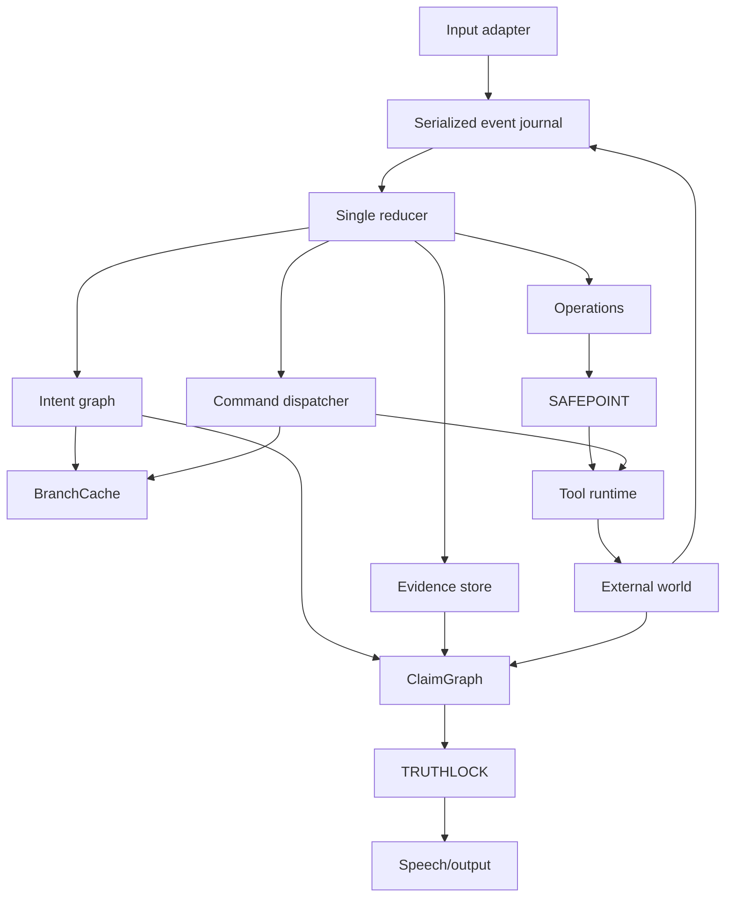

# Architecture Overview

INTERLOCK is a domain-generic modular monolith with a demo-specific protocol adapter. The backend owns truth; the frontend renders projections.

The journal assigns a session-local monotonic sequence and delivers accepted facts one at a time. The pure reducer returns a new `SessionState` and commands; a dispatcher executes commands asynchronously and returns results as new events. Replay suppresses command dispatch, so rebuilding state cannot repeat external writes.

BranchCache performs bounded read-only preparation. SAFEPOINT separates preparation, authorization, dispatch, cancellation, and effect observation. The World Effect Ledger records confirmed reality even when its originating operation is stale. Reconciliation compares desired and observed state. ClaimGraph derives claim state from evidence; TRUTHLOCK validates structured `SpeechAct` objects and uses controlled wording for consequential claims.

The stack is Python 3.11, FastAPI, asyncio, Pydantic, WebSockets, pytest, React, Vite, and Tailwind CSS. State is in-memory for the prototype; external writes are not exactly-once unless the provider honors idempotency.

Detailed documents: [system](docs/architecture/SYSTEM_ARCHITECTURE.md), [runtime](docs/architecture/RUNTIME_ARCHITECTURE.md), [concurrency](docs/architecture/CONCURRENCY_MODEL.md), [guarantees](docs/architecture/GUARANTEES_AND_LIMITATIONS.md), and [repository blueprint](docs/architecture/REPOSITORY_BLUEPRINT.md).
