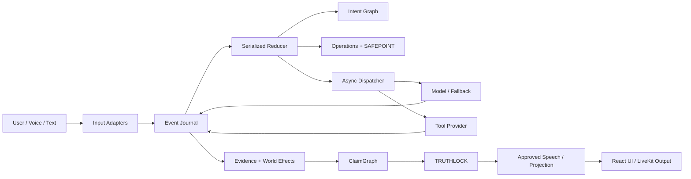

# INTERLOCK

> **Interruptible agents should not confuse what the user wants, what the system tried, what the world actually did, and what the agent is allowed to say.**

INTERLOCK is a consistency runtime for real-time AI agents that can be interrupted while they are thinking, calling tools, changing external state, and speaking.

It is built around one uncomfortable fact:

> **Stopping an agent is not the same as undoing the world.**

A booking may already have committed. A remote API may return late. A user may change their mind while work is in flight. INTERLOCK keeps those races explicit instead of letting the agent silently overwrite reality or confidently claim something it cannot verify.

---

## Why INTERLOCK exists

Consider a user saying:

```text
"Book 11:00."
        ↓
provider receives the request
        ↓
"Actually, make it 12:00."
        ↓
the 11:00 result arrives late
```

A naïve agent may cancel a local task, forget the old request, and proceed as if 12:00 is now reality.

INTERLOCK does not.

The runtime separates:

| Layer | Meaning |
|---|---|
| **Intent** | What the user currently wants |
| **Operation** | What work has been authorized and dispatched |
| **Reality** | What authoritative external effects actually happened |
| **Claim** | What the system can currently prove |
| **Speech** | What the agent is allowed to tell the user |

If reality is **11:00** while current intent is **12:00**, INTERLOCK preserves both facts and surfaces the mismatch instead of inventing a successful 12:00 booking.

---

## The core model

INTERLOCK is built around three ideas:

### ANTICIPATE

Prepare safe work early without letting speculative work mutate external state.

### ADAPT

Use explicit SAFEPOINT boundaries to decide whether work can still be cancelled, superseded, or must be treated as potentially committed.

### VERIFY

Turn tool results into evidence, evidence into claims, and claims into speech through **ClaimGraph + TRUTHLOCK**.

The result is an agent that can stay responsive without sacrificing consistency.

---

## Canonical race

```text
User intent: 11:00
      │
      ▼
Operation prepared
      │
      ▼
Provider dispatch ───────────────► external world may already change
      │
      │     User: "Actually make it 12:00"
      │                    │
      │                    ▼
      │             active intent = 12:00
      │
      ▼
Late provider result: 11:00 committed
      │
      ▼
Authoritative reality = 11:00
Desired intent        = 12:00
      │
      ▼
OPEN DIVERGENCE
      │
      ▼
TRUTHLOCK refuses a false "12:00 is booked" claim
```

This is the central INTERLOCK demo: **the system preserves late truth instead of rewriting history.**

---

## Architecture



The reducer is the **single authoritative writer** of session state.

Workers, models, providers, HTTP handlers, WebSocket transports, and voice adapters may run concurrently, but they return facts through the journal. They do not directly mutate authoritative state.

---

## Safety properties

INTERLOCK is designed around a few non-negotiable rules:

- **Late effects remain real.** A superseded request does not erase a confirmed physical side effect.
- **Post-dispatch timeout means uncertainty.** It never means “nothing happened.”
- **No blind replacement writes.** If an old write may have crossed the provider boundary, INTERLOCK does not automatically issue the new write.
- **Replay performs zero external work.**
- **Speculative branches cannot write.**
- **Evidence is immutable.**
- **Consequential speech is truth-gated.**
- **Contradictory terminal callbacks do not rewrite already-established physical truth.**
- **Adapters are transport.** They never become a second authoritative runtime.

---

## What is in the repository

| Area | Implementation |
|---|---|
| Runtime | Event journal, reducer, session lifecycle, async dispatcher |
| Intelligence | semantic control boundary, intent revisions, fallback/model adapters |
| Execution | tool manifests, idempotency, SAFEPOINT, cancellation, effects |
| Truth | evidence, ClaimGraph, TRUTHLOCK, corrective speech |
| API | FastAPI HTTP + WebSocket projection boundary |
| Demo | deterministic Samsung-shaped simulated provider |
| Voice | LiveKit adapter path and speech lifecycle contracts |
| Benchmark | Full-Duplex-Bench v3 adapter + reproduction script |
| Frontend | React + Vite interface, intent/reality view, Black Box recorder |
| Tests | unit, contract, concurrency, scenario, invariant and reproduction tests |

---

## Quick start — deterministic demo

The fastest way to see INTERLOCK is the credential-free demo.

### Requirements

- Python **3.11**
- Node.js **20.19+**
- backend virtual environment installed
- frontend dependencies installed

### 1. Start the backend

From the repository root:

```bash
INTERLOCK_MODE=DEMO \
INTERLOCK_MODEL_PROVIDER=fallback \
INTERLOCK_FAKE_LATENCY_MS=3000 \
PYTHONPATH=backend \
.venv/bin/python -m uvicorn interlock.main:app \
  --host 127.0.0.1 \
  --port 8000
```

Health check:

```text
http://127.0.0.1:8000/api/v1/health
```

Expected:

```json
{"status":"ok","mode":"DEMO"}
```

### 2. Start the frontend

```bash
cd frontend
VITE_INTERLOCK_API_URL=http://127.0.0.1:8000/api/v1 npm run dev
```

Open:

```text
http://localhost:5173
```

### 3. Trigger the correction race

Start a fresh DEMO session and enter:

```text
Book 11:00.
```

Then, while the first request is still delayed:

```text
Actually, make it 12:00.
```

The important result is **not** “everything magically became 12:00.”

The expected P0 outcome is:

```text
Desired intent     → 12:00
Authoritative world→ 11:00
Divergence         → OPEN
Automatic repair   → none
False 12:00 claim  → never emitted
```

The UI deliberately exposes the disagreement between intent and reality.

> The simulated provider is intentionally deterministic. No official Samsung API is used or claimed.

---

## Black Box

INTERLOCK includes a causal recorder for inspecting the runtime as an event sequence.

It exposes the history behind the visible state:

```text
transcript
→ control interpretation
→ intent revision
→ authorization
→ operation
→ provider dispatch
→ tool result
→ evidence
→ world effect
→ claim transition
→ divergence
→ speech approval
→ emission
```

This makes races inspectable instead of hiding them behind a chatbot transcript.

---

## LiveKit and Full-Duplex-Bench v3

The repository also contains the LiveKit/FDB-v3 integration path used for the voice-agent benchmark target.

The benchmark wrapper is intentionally strict:

- Python 3.11
- `livekit-agents==1.8.4`
- official FDB-v3 checkout pinned to commit `3e799c45a045256f47d5f1c9cda90157e2d2ec9e`
- fresh INTERLOCK state per benchmark conversation
- explicit provenance for evaluator artifacts
- fail-closed behavior for missing prerequisites or invalid benchmark state

After installing the official benchmark dependencies and configuring the required provider/LiveKit credentials:

```bash
./scripts/reproduce_fdb_v3.sh
```

Artifacts are written under:

```text
artifacts/fdb-v3/<UTC run id>/
```

The repository does **not** claim an FDB score unless it came from a real official evaluator run.

---

## Local verification

Backend:

```bash
PYTHONPATH=backend .venv/bin/pytest -W error -q
PYTHONPATH=backend .venv/bin/python -m compileall -q backend/interlock backend/tests
```

Frontend:

```bash
cd frontend
npm ci
npm test -- --run
npm run typecheck
npm run build
```

Repository hygiene:

```bash
git diff --check
```

---

## Repository map

```text
404-samsung/
├── backend/
│   ├── interlock/
│   │   ├── adapters/        # HTTP, WebSocket, LiveKit, Samsung/FDB boundaries
│   │   ├── domain/          # immutable domain models and events
│   │   ├── execution/       # operations, tools, SAFEPOINT, effects
│   │   ├── intelligence/    # control + intent graph
│   │   ├── providers/       # model/tool provider implementations
│   │   ├── runtime/         # journal, reducer, dispatcher, sessions
│   │   ├── testing/         # deterministic clock, fixtures, fault/scenario harness
│   │   └── truth/           # evidence, claims, speech, TRUTHLOCK
│   ├── scenarios/
│   └── tests/
├── frontend/
│   └── src/
│       ├── api/
│       ├── state/
│       └── ui/
├── docs/
└── scripts/
```

---

## Scope

INTERLOCK is **not** a generic chatbot, scheduling product, payment system, or multi-agent swarm.

The Samsung-shaped appointment flow is a deterministic demonstration domain for the runtime.

The real product idea is the consistency layer underneath:

> **an agent can change its mind quickly without pretending the external world changed with it.**

Production persistence/HA, arbitrary-provider exactly-once guarantees, automatic reconciliation, and broader domain integrations remain outside the current P0 scope.

---

## Documentation

Start here:

- [Documentation index](docs/INDEX.md)
- [Product specification](docs/product/PRODUCT.md)
- [System architecture](docs/architecture/SYSTEM_ARCHITECTURE.md)
- [Runtime architecture](docs/architecture/RUNTIME_ARCHITECTURE.md)
- [State machines](docs/architecture/STATE_MACHINES.md)
- [TRUTHLOCK](docs/components/TRUTHLOCK.md)
- [SAFEPOINT](docs/components/SAFEPOINT.md)
- [Demo runbook](docs/demo/DEMO_RUNBOOK.md)
- [Test strategy](docs/testing/TEST_STRATEGY.md)

---

<p align="center">
  <strong>Anticipate early. Adapt safely. Verify before speaking.</strong>
</p>
