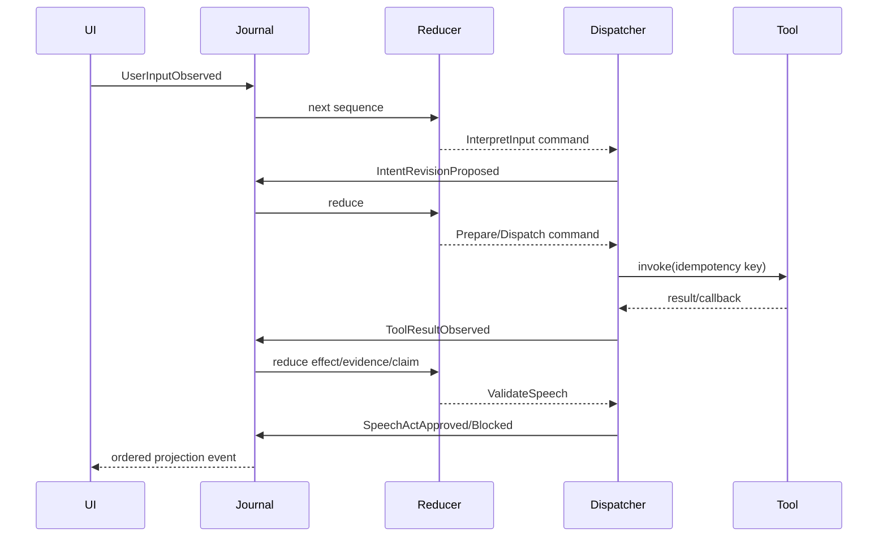

# Runtime Architecture

Startup validates configuration and built-in/fake manifests, creates journal/reducer/dispatcher registries, starts workers, then exposes HTTP/WebSocket. A session starts with sequence 1 and a snapshot. Inputs are boundary-validated and journaled; the reducer synchronously produces state plus immutable commands. The dispatcher runs model/tool/output work asynchronously and journals result events.

World-effect processing occurs for every authoritative result, stale or current. Claim evaluation follows evidence/effect updates. Speech validation reads a sequence-pinned snapshot and returns a decision event; the reducer rechecks referenced claim versions before queueing output.

The planned LiveKit wrapper must remain a transport at this boundary: partial/final transcript and barge-in callbacks append observations promptly, speech cancellation must not wait for tool completion, and model/tool work runs in background tasks while the reducer remains serialized. Progress speech must pass a safe low-certainty policy and cannot assert a completed external effect. A conversation owns one fresh session and ephemeral tool/model context; teardown must quiesce workers and clear session-scoped caches before any benchmark scenario ID could be reused. This lifecycle is a `VCE-001`/`FDB-001` acceptance requirement, not current executable behavior.

Shutdown stops new sessions, closes intake after accepted work, drains reducers, requests only legal cancellations, marks unresolved dispatched writes unknown, sends final snapshots, then closes workers. Session cleanup occurs after configurable idle retention and is not durable.
