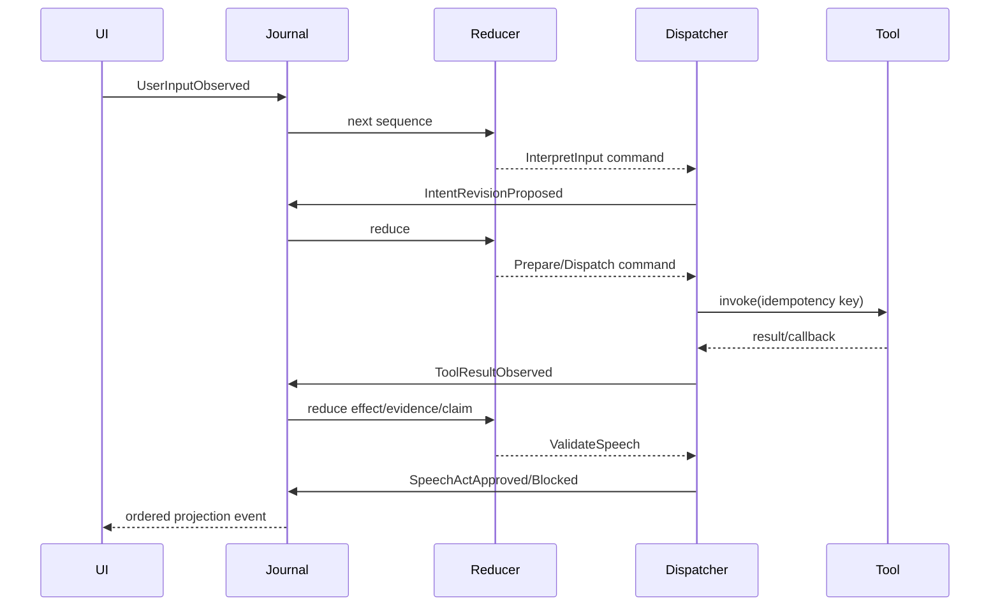

# Runtime Architecture

Startup validates configuration and built-in/fake manifests, creates journal/reducer/dispatcher registries, starts workers, then exposes HTTP/WebSocket. A session starts with sequence 1 and a snapshot. Inputs are boundary-validated and journaled; the reducer synchronously produces state plus immutable commands. The dispatcher runs model/tool/output work asynchronously and journals result events.

World-effect processing occurs for every authoritative result, stale or current. Claim evaluation follows evidence/effect updates. Speech validation reads a sequence-pinned snapshot and returns a decision event; the reducer rechecks referenced claim versions before queueing output.

Shutdown stops new sessions, closes intake after accepted work, drains reducers, requests only legal cancellations, marks unresolved dispatched writes unknown, sends final snapshots, then closes workers. Session cleanup occurs after configurable idle retention and is not durable.
