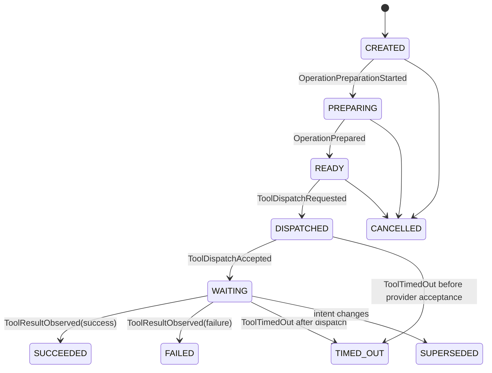
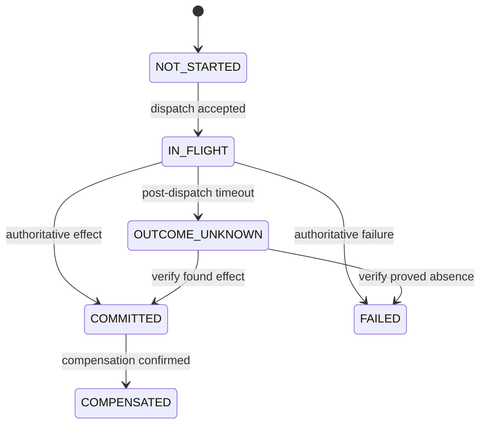

# Canonical State Machines

Invalid transitions do not mutate the entity; they yield a `ProtocolViolationObserved` command for live ingestion and fail deterministic tests.

## Transition tables

| Machine | Legal transitions (event / guard) | Terminal/recovery |
|---|---|---|
| Intent maturity | `PROVISIONAL→COMMITTED` (`IntentRevisionCommitted`, semantically complete and stable); either → `SUPERSEDED` (new active revision) | commitment does not grant action authorization; superseded revision stays immutable |
| Authorization | `NOT_REQUESTED→REQUIRED→AUTHORIZED|DENIED`; `AUTHORIZED→EXPIRED` when bound values change | new evidence may authorize new revision, never old changed args |
| Branch | `PREDICTED→PREPARING` (`BranchPreparationStarted`); `PREPARING→READY` (`BranchPreparationCompleted`); `READY→PROMOTED` (`BranchPromoted`); nonterminal → `EXPIRED|EVICTED|INVALIDATED|FAILED` | terminal; cache miss creates normal work |
| Operation | `CREATED→PREPARING` (`OperationPreparationStarted`); `PREPARING→READY` (`OperationPrepared`); `READY→DISPATCHED` (`ToolDispatchRequested`, fingerprint/auth valid); `DISPATCHED→WAITING` (`ToolDispatchAccepted`); `DISPATCHED|WAITING→SUCCEEDED|FAILED|TIMED_OUT` (result/timeout); pre-dispatch active → `CANCELLED`; any nonterminal → `SUPERSEDED` | stale results can update effect dimension, not reactivate operation; an accepted late result may leave operation SUPERSEDED while effect changes |
| Cancellation | `NONE→REQUESTED→ACKNOWLEDGED|REJECTED|TOO_LATE` | ACKNOWLEDGED is not proof of no commit |
| Effect | `NOT_STARTED→IN_FLIGHT` (`ToolDispatchAccepted`); `IN_FLIGHT→COMMITTED|FAILED|OUTCOME_UNKNOWN`; after `ToolDispatchRequested`, authoritative result/timeout may move `NOT_STARTED→COMMITTED|FAILED|OUTCOME_UNKNOWN` if provider acceptance arrives out of order; `OUTCOME_UNKNOWN→COMMITTED|FAILED` after verify; `COMMITTED→COMPENSATED` with authoritative compensation | ledger history retained; arrival order does not override authority |
| Claim | `PROPOSED→PENDING→CONFIRMED|CONTRADICTED|UNCERTAIN`; current → `STALE|SUPERSEDED`; `UNCERTAIN→CONFIRMED|CONTRADICTED` | revalidation makes a new change event |
| Speech | `PROPOSED→APPROVED|BLOCKED` (`SpeechActApproved` or `SpeechActBlocked`); `APPROVED→QUEUED` (`SpeechQueued`); `QUEUED→EMITTING` (`SpeechEmissionStarted`); `EMITTING→EMITTED` (`SpeechEmissionFinished`); pre-emission active → `CANCELLED`; `EMITTED→CORRECTION_REQUIRED` after a supporting claim is contradicted | correction is a new SpeechAct |
| Divergence | `OPEN→PLANNED→RECONCILING→RESOLVED|ESCALATED`; `OPEN|PLANNED→ESCALATED` on manual-only policy, denied repair, or terminal failure; RECONCILING→RESOLVED only after the active plan’s `VERIFY_FINAL` evidence | new intent supersedes the plan and redetects/replans the case from current facts |
| Plan | `DRAFT→AUTHORIZED` (`ReconciliationAuthorized`); `DRAFT→FAILED` (`ReconciliationDenied`); `AUTHORIZED→RUNNING` (first running step); `RUNNING→SUCCEEDED|FAILED`; nonterminal → `SUPERSEDED` when base intent/capability changes | rebuild plan from current facts |

Operation and effect states are deliberately orthogonal: `operation=SUPERSEDED`, `cancellation=ACKNOWLEDGED`, `effect=COMMITTED` is valid.

Guards never perform I/O. Resulting external work is emitted as a command. A failed reconciliation ends `ESCALATED`; UI and speech state uncertainty and manual verification. Shutdown leaves dispatched writes `OUTCOME_UNKNOWN` in the final in-memory trace, though the state is lost on process exit.
