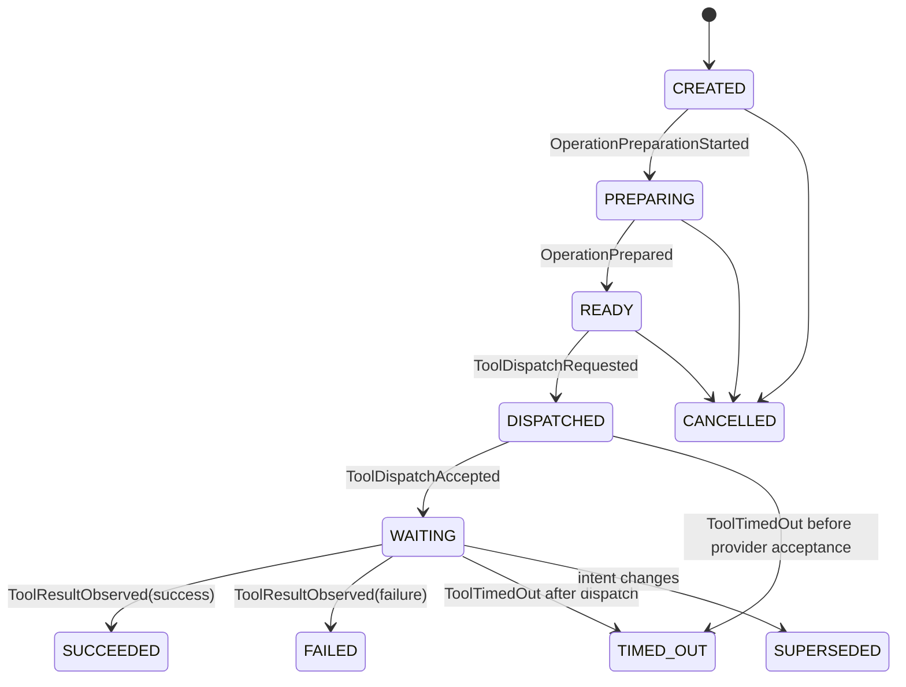
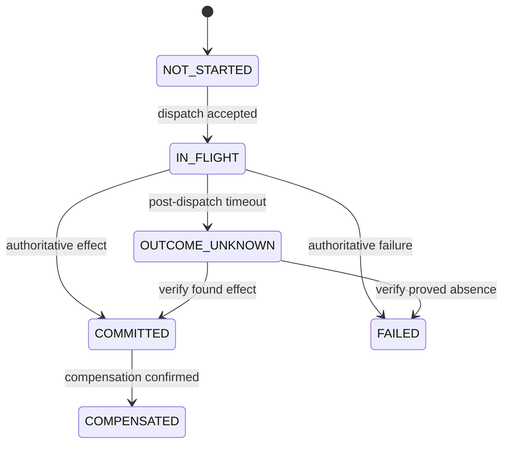
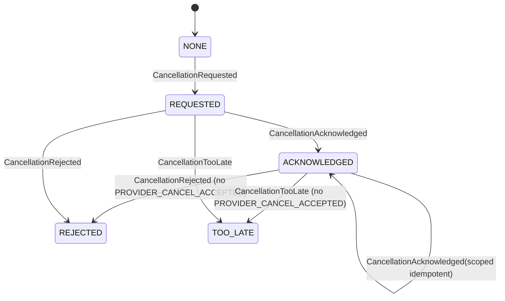

# Canonical State Machines

Invalid transitions do not mutate the entity; they yield a `ProtocolViolationObserved` command for live ingestion and fail deterministic tests.

## Transition tables

| Machine | Legal transitions (event / guard) | Terminal/recovery |
|---|---|---|
| Intent maturity | `PROVISIONAL→COMMITTED` (`IntentRevisionCommitted`, semantically complete and stable); when a new child revision commits, previous active revision maturity transitions to `SUPERSEDED`. Stored revisions remain inspectable. Commitment does not grant action authorization (begins `NOT_REQUESTED`); authorization of a `SUPERSEDED` revision is invalid. | commitment does not grant action authorization; superseded revision stays immutable |
| Authorization | `NOT_REQUESTED→REQUIRED|AUTHORIZED|DENIED`; `REQUIRED→AUTHORIZED|DENIED`; `AUTHORIZED→EXPIRED` when bound values change. Direct transition from `NOT_REQUESTED` to `AUTHORIZED` or `DENIED` requires the explicit `IntentAuthorizationChanged` user/policy fact (e.g. from user decision via `/authorizations` endpoint). Intent commitment alone never grants authorization. | new evidence may authorize new revision, never old changed args |
| Branch | `PREDICTED→PREPARING` (`BranchPreparationStarted`); `PREPARING→READY` (`BranchPreparationCompleted`); `READY→PROMOTED` (`BranchPromoted`); nonterminal → `EXPIRED|EVICTED|INVALIDATED|FAILED` | terminal; cache miss creates normal work |
| Operation | `CREATED→PREPARING` (`OperationPreparationStarted`); `PREPARING→READY` (`OperationPrepared`); `READY→DISPATCHED` (`ToolDispatchRequested`, fingerprint/auth valid, matching sequence pin `validated_through_sequence == last_sequence`); `DISPATCHED→WAITING` (`ToolDispatchAccepted`); `DISPATCHED|WAITING→SUCCEEDED|FAILED|TIMED_OUT` (result/timeout); pre-dispatch active → `CANCELLED`; any nonterminal → `SUPERSEDED` | stale results and authorized `ToolTimedOut(after_dispatch=true)` ambiguity can update the effect dimension without reactivating or rewriting TIMED_OUT/CANCELLED/SUPERSEDED lifecycle state |
| Cancellation | `NONE→REQUESTED→ACKNOWLEDGED|REJECTED|TOO_LATE`; `ACKNOWLEDGED→REJECTED|TOO_LATE` permitted for multi-stage cancellations (e.g. `LOCAL_TASK` ack before provider outcome), provided `PROVIDER_CANCEL_ACCEPTED` is not in `cancellation_ack_scopes`. If `PROVIDER_CANCEL_ACCEPTED` has been observed, subsequent `REJECTED` or `TOO_LATE` contradicts an established fact and yields `RecordProtocolViolation`. Duplicate acknowledgements are idempotent. | ACKNOWLEDGED is not proof of no commit; REJECTED and TOO_LATE preserve operation and effect states and do not imply effect absence or commit |
| Effect | `NOT_STARTED→IN_FLIGHT` (`ToolDispatchAccepted`); `IN_FLIGHT→COMMITTED|FAILED|OUTCOME_UNKNOWN`; after `ToolDispatchRequested`, authoritative result or `ToolTimedOut(after_dispatch=true)` may move `NOT_STARTED→COMMITTED|FAILED|OUTCOME_UNKNOWN` if provider acceptance arrives out of order; repeated post-dispatch ambiguity keeps `OUTCOME_UNKNOWN` and requests verification; `OUTCOME_UNKNOWN→COMMITTED|FAILED` after verify; `COMMITTED→COMPENSATED` with authoritative compensation | ledger history retained; arrival order does not override authority; late acceptance or ambiguity never downgrades `COMMITTED`, `FAILED`, or `COMPENSATED` effect truth |
| Claim | `PROPOSED→PENDING→CONFIRMED|CONTRADICTED|UNCERTAIN`; current → `STALE|SUPERSEDED`; `UNCERTAIN→CONFIRMED|CONTRADICTED` | revalidation makes a new change event |
| Speech | `PROPOSED→APPROVED` (`SpeechActApproved`, valid sequence pin `through_sequence == last_sequence` and exact matching `claim_versions`; stale pin/version retries `ValidateSpeech` remaining `PROPOSED`); `PROPOSED→BLOCKED` (`SpeechActBlocked`); `APPROVED→QUEUED` (`SpeechQueued`, rechecking claim currency; stale claim or cancellation cancels to `CANCELLED`); `QUEUED→EMITTING` (`SpeechEmissionStarted`); `EMITTING→EMITTED` (`SpeechEmissionFinished`); active cancellation (`QUEUED`/`EMITTING`) sets `cancellation_pending=True` and emits `CancelSpeech`, awaiting adapter completion; active supporting claim contradiction sets `cancellation_pending=True` and `correction_pending=True` and emits `CancelSpeech`; upon adapter completion (`SpeechEmissionFinished`/`SpeechEmissionFailed`), if `heard=True` and `correction_pending=True`, moves to `CORRECTION_REQUIRED` and emits `RequestSpeechCorrection`; if `heard=False`, moves to `CANCELLED` (if `cancellation_pending` or failed) or `EMITTED`; if `heard=True` without correction pending, moves to `EMITTED`; `EMITTED` with `heard=True` moves to `CORRECTION_REQUIRED` on subsequent supporting claim contradiction; pre-emission active (`APPROVED`) invalidated moves to `CANCELLED` | correction is a new SpeechAct; old speech retains rendered_text |
| Divergence | `OPEN→PLANNED→RECONCILING→RESOLVED|ESCALATED`; `OPEN|PLANNED→ESCALATED` on manual-only policy, denied repair, or terminal failure; RECONCILING→RESOLVED only after the active plan’s `VERIFY_FINAL` evidence | new intent supersedes the plan and redetects/replans the case from current facts |
| Plan | `DRAFT→AUTHORIZED` (`ReconciliationAuthorized`); `DRAFT→FAILED` (`ReconciliationDenied`); `AUTHORIZED→RUNNING` (first running step); `RUNNING→SUCCEEDED|FAILED`; nonterminal → `SUPERSEDED` when base intent/capability changes | rebuild plan from current facts |

Operation and effect states are deliberately orthogonal: `operation=SUPERSEDED`, `cancellation=ACKNOWLEDGED`, `effect=COMMITTED` is valid.

`EffectRecord.state` is the immutable state of one observation, not a mutable row for a physical object. A successful compensation is a new authoritative `COMPENSATED` observation linked by `supersedes_effect_id`; the prior `COMMITTED` observation remains. The original operation's effect dimension may advance to `COMPENSATED` without reactivating a superseded/cancelled/timed-out lifecycle. Conflicting authoritative observations do not rewrite historical `COMMITTED` facts or downgrade their operation state; the *derived current-world projection* is uncertain until targeted verification resolves the physical or logical-action conflict. A weaker later `OUTCOME_UNKNOWN` observation cannot revoke a prior authoritative commit.

Guards never perform I/O. Resulting external work is emitted as a command. A failed reconciliation ends `ESCALATED`; UI and speech state uncertainty and manual verification. Shutdown leaves dispatched writes `OUTCOME_UNKNOWN` in the final in-memory trace, though the state is lost on process exit.
