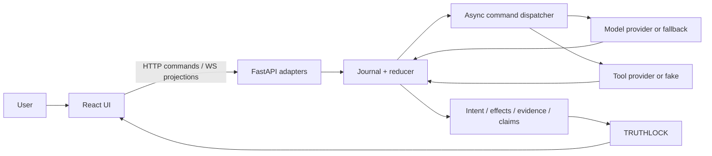

# System Architecture

Allowed dependencies point inward: adapters → application/runtime → domain policies. Provider implementations depend on contract protocols, never the reverse. The reducer owns all session state. Adapters validate untrusted transport; model outputs are proposals; provider observations require descriptor-defined authority. Commands flow outward from reducer decisions, facts flow inward through the journal, and projections flow read-only to clients.

Trust boundaries exist at user input, model output, tool manifests/results, network transports, and frontend. Secrets stay in provider adapters and never enter event payloads. The Samsung adapter maps provisional external messages to generic events/tools; domain modules contain no Samsung-specific branches.

A modular monolith minimizes deployment and ordering complexity for four hackathon developers while retaining module protocols and tests. The UI can be replaced without altering consistency rules; the deterministic fake provider can replace external integration without altering the tool contract.

Major responsibilities are detailed in [Interfaces](../contracts/INTERFACES.md) and [component specifications](../INDEX.md#map).
