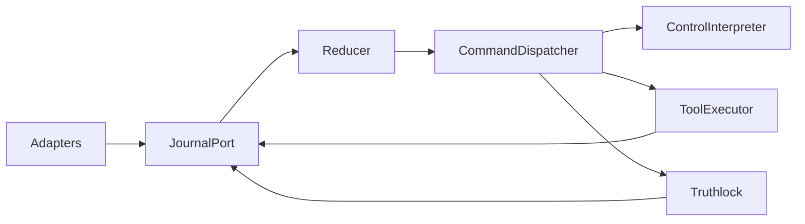

# Cross-Module Interfaces

Signatures are language-neutral contracts, not executable code.

| Interface | Owner; caller | Input → output; behavior | Failures, effects, events/invariants |
|---|---|---|---|
| `JournalPort.append` | Runtime; adapters/workers | unsequenced validated fact → accepted `EventEnvelope` | async serialized; duplicate returns prior acceptance; invalid rejects; FR-001 |
| `Reducer.reduce` | Runtime; journal | `SessionState, EventEnvelope, mode` → `new_state, Command[]` | sync/pure; invalid transition violation command; I11/I12 |
| `CommandDispatcher.submit` | Runtime; reducer loop | immutable command → eventual event(s) | async; no direct state; correlated errors |
| `ControlInterpreter.interpret` | Intelligence; dispatcher | evidence + snapshot summary → `ControlIntent, IntentDelta?` | timeout/invalid → fallback or clarification; no mutation; I7 |
| `IntentGraph.apply_delta` | Intelligence policy; reducer | active graph + delta → proposed revision/bindings | deterministic validation; emits revision event |
| `BranchPlanner.predict` | Intelligence; dispatcher | active intent + descriptors + budget → candidates | read-only candidates only; I2 |
| `SafePointPolicy.decide` | Execution policy; reducer | operation + current revision + event → `CONTINUE|CANCEL|HOLD|UNKNOWN` commands | pure; I3/I14 |
| `ToolRegistry.register` | Execution; composition | raw manifest → `ToolDescriptor` | conservative normalization or reject |
| `ToolExecutor.invoke` | Execution; dispatcher | descriptor, args, idempotency key, cancel token → normalized observations | external side effect; timeouts/callbacks evented; I5 |
| `EffectInterpreter.observe` | Execution; reducer policy | result + descriptor semantics → evidence/effect events | stale retained; conflicting authority → unknown; I4/I9 |
| `Reconciler.plan` | Execution; dispatcher | desired revision, effects, capabilities → plan | no execution; requires authorization when consequential; I10 |
| `EvidenceStore.add` | Truth/Intelligence; reducer | immutable record → insert/idempotent existing | conflicting same ID violation; I8 |
| `ClaimEvaluator.evaluate` | Truth; reducer policy | claim + evidence/effects + sequence → state-change events | no I/O; freshness/authority rules; FR-014 |
| `Truthlock.validate` | Truth; dispatcher | SpeechAct + pinned claims/evidence → decision + controlled text | stale pin retries; unsupported blocks; I6 |
| `OutputPort.emit/cancel` | Truth adapter; dispatcher | approved text/speech ID → lifecycle events | cancelling output never cancels operation |
| `ProjectionHub.publish` | Runtime; reducer loop | sequence + sanitized projection delta → clients | gaps resolved through snapshot endpoint |
| `Clock.now/schedule` | Testing/runtime; workers | duration/callback → logical schedule handle | virtual in tests, monotonic in live |

All interfaces are session-scoped. Cancellation is cooperative according to descriptors; idempotency applies to logical action IDs and declared provider support.

For `EffectInterpreter.observe`, `effect_id` is a stable local observation identity, `provider_effect_id` is the provider-qualified physical identity, and `logical_action_id` is the incident group for one intended action. It must not reuse an `effect_id` for changed content. The reducer stores a deep copy of each new observation; exact repeated IDs preserve the original object and conflicting repeated IDs fail closed. Distinct observations of one physical effect are retained; authoritative disagreement makes the derived current-world projection unresolved and requests `VerifyOutcome(operation_id, provider_effect_id=...)`. Distinct physical IDs for one logical action are retained and each receives an individually targeted `VerifyOutcome`. The optional physical target is additive; operation-only verification remains valid for timeouts. Verification adds evidence and a new observation, never mutates history. The verification provenance and projection rule are defined in `WORLD_EFFECTS.md`. `COMPENSATED` links to an existing committed observation of the same physical effect using `supersedes_effect_id`.

The P0 `EffectInterpreter` mapping uses `effect_type="appointment.booking"` for confirmed `appointment.book`, authoritative `appointment.get` booking readback, and confirmed `appointment.cancel` compensation (state `COMPENSATED`). Unknown effect-producing tools fail closed; `appointment.cancellation` is not a separate effect type.

The EXE-005 implementation takes explicit `known_effects` and `known_evidence` snapshots. Its local `VerificationScope` carries the original booking operation/action pair and triggering request ID; an absent physical target with empty coverage is operation-only verification, while a physical target requires complete prior authoritative coverage. Verification and compensation observations retain the booking pair in `EffectRecord`; evidence identifies the separate read/cancel producer. This preserves existing reducer correlation without changing event or command schemas. Compensation selects the projection's resolved current committed observation, including one established by scoped verification. See `WORLD_EFFECTS.md` for producer validation and multi-incident projection semantics.

## Normative interface details

### `JournalPort.append(candidate)`

- Input: validated event type, `session_id`, `source`, payload, optional causal/dedupe fields; callers never assign sequence.
- Output: accepted envelope or the previously accepted envelope for an identical dedupe key.
- Errors: `UNKNOWN_SESSION`, `SCHEMA_INVALID`, `UNSUPPORTED_VERSION`, `DEDUPE_CONFLICT`, `SESSION_HALTED`.
- Concurrency: linearized under the per-session journal lock; cancellation before acceptance changes nothing, after acceptance cannot retract the fact.
- Side effect: appends in memory and wakes the reducer; never calls external providers.

### `Reducer.reduce(state, envelope, mode)`

- Preconditions: envelope session matches state and sequence is exactly `last_sequence + 1` (except `SessionStarted` creating state).
- Output: a fully new state value, ordered command list, and sanitized projection delta pinned to the sequence.
- Errors: an invalid transition preserves business/entity state, consumes the already accepted envelope by advancing reducer cursor/metrics, and returns `RecordProtocolViolation`; an unexpected reducer defect leaves state uncommitted and halts the session.
- Replay: `mode=REPLAY` computes state/projection but the loop discards every command.

### `ToolExecutor.invoke(invocation)`

`invocation` contains `operation_id`, dispatch authorization token (`dispatch_requested_event_id`), descriptor capability hash, validated arguments, logical action ID, idempotency key, deadline, speculative flag, and cancellation token. It emits `ToolDispatchAccepted`, zero or more acknowledgement `ToolResultObserved` events, and one terminal result/timeout event. It must not emit `WorldEffectObserved`; effect interpretation is reducer policy. Cancellation behavior comes only from the descriptor. Reusing a write idempotency key with different normalized arguments is `IDEMPOTENCY_CONFLICT` and no provider call.

### `Reconciler.plan(snapshot)`

Input is an immutable sequence-pinned desired revision, authoritative effects, open divergence, normalized provider capabilities, and authorization scope. Output is either a deterministic `ReconciliationPlan`, `MANUAL_ONLY(reason)`, or `NEEDS_AUTHORIZATION(scope)`. Planning has no side effect. Executing each plan step uses normal Operation Manager/SAFEPOINT/ToolRuntime interfaces; the reconciler has no privileged write path.

### `Truthlock.validate(request)`

Input contains the SpeechAct, claim versions and evidence records at `through_sequence`, plus policy version. Output is `APPROVE(template, text, through_sequence, claim_versions)`, `BLOCK(reason, max_certainty)`, or `RETRY_STALE_SNAPSHOT`. The decision forwards `through_sequence` and exact `claim_versions` (mapping each `claim_id` to `ClaimRecord.updated_by_event_id`) into `SpeechActApproved`. Stale sequence pins or claim version mismatches consumed by the reducer retry via `ValidateSpeech` rather than approving. On claim contradiction of emitted heard speech, the reducer emits `RequestSpeechCorrection`. For a correction child, replacement is reducer-owned and requires canonical epistemic invalidation: direct APPROVED claim advancement, pre-queue claim-version staleness, or an active child previously marked `correction_pending=True` that terminalizes unheard. Generic policy blocks, explicit user/barge-in cancellation, and plain `SpeechEmissionFailed` do not automatically re-request the parent. A heard correction satisfies its parent; later claim invalidation creates a distinct correction obligation on that correction. Replay suppresses all commands. Validation is idempotent for `(speech_id, through_sequence, policy_version)`.
